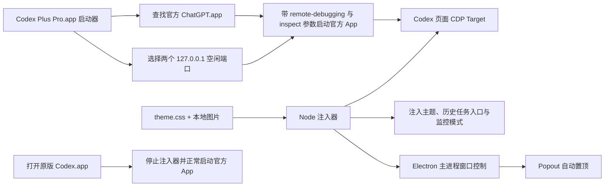

# Codex macOS 自定义主题开发指南

本文记录一次完整的 Codex / ChatGPT macOS 桌面端深度主题开发实践：从界面探查、CSS 设计、图片资产处理、运行时注入，到一键启动、恢复原版、签名、回归测试与版本维护。

适用基线：Codex / ChatGPT macOS `26.715.31925`。桌面端更新可能改变 DOM 和内部 Popout 服务，后续版本需要重新验证。

## 先说结论

Codex 官方的 **Settings > Appearance** 已支持基础主题、强调色、背景色、前景色、界面字体和代码字体，也支持分享自定义配色。这应当是普通配色需求的首选。

当需求扩展到以下内容时，公开设置能力并不足以表达完整效果：

- 使用本地图片作为工作区壁纸；
- 给侧栏增加纹理、水印或品牌图形；
- 改造输入框、发送状态、输出面板和新建任务页；
- 用自定义图片替换某个原生图标；
- 为不同页面建立不同的视觉结构。

本文采用的是 **本地 CDP 运行时注入**。它不修改官方 App，但仍是非官方扩展方案，不是 OpenAI 承诺稳定的主题 API。应用升级后需要回归测试。

## 方案选择

| 方案 | 能力 | 维护成本 | 风险 | 建议 |
| --- | --- | --- | --- | --- |
| 官方 Appearance | 配色、字体、基础主题 | 低 | 低 | 普通主题首选 |
| CDP 运行时 CSS 注入 | 壁纸、组件外观、页面级定制 | 中 | DOM 更新后可能失效 | 深度主题可用 |
| 修改官方 App / ASAR | 理论上几乎无限 | 高 | 破坏签名、更新和完整性 | 不推荐 |

这次实践选择第二种，并坚持一个原则：**官方 App 只负责运行，所有主题文件都放在独立启动器中。**

## 总体架构



主题运行时只有三类写入：

1. `~/Library/Logs/Codex-Plus-Pro.log`：启动与注入日志；
2. `~/Library/Application Support/Codex-Plus-Pro/injector.pid`：注入器进程号；
3. 当前 Codex 页面内存中的 `<style>` 和少量 `data-*` 标记。

不会修改 `/Applications/ChatGPT.app`、账号、任务记录或模型配置。

## 推荐目录结构

```text
codex-theme/
├── theme.css
├── injector.mjs
├── launcher.zsh
├── restore-original.zsh
├── Info.plist
├── Restore-Info.plist
├── VERSION
└── assets/
    ├── wallpaper.jpg
    ├── logo.png
    └── app-icon.png
```

最终打包时，主题应用的关键结构是：

```text
Codex Theme.app/
└── Contents/
    ├── Info.plist
    ├── MacOS/
    │   └── Codex-Theme
    └── Resources/
        ├── AppIcon.icns
        ├── injector.mjs
        ├── theme.css
        ├── wallpaper.jpg
        └── logo.png
```

## 第一步：建立安全的探查环境

不要直接在主 Codex 窗口中反复试验。用独立用户数据目录和独立调试端口启动测试实例：

```zsh
'/Applications/ChatGPT.app/Contents/MacOS/ChatGPT' \
  --user-data-dir=/tmp/codex-theme-profile \
  --remote-debugging-address=127.0.0.1 \
  --remote-debugging-port=9334
```

然后检查 CDP 是否可用：

```zsh
curl -fsS http://127.0.0.1:9334/json/version
curl -fsS http://127.0.0.1:9334/json/list
```

注意：桌面端可能仍复用本机账号状态，因此测试截图、DOM 输出和日志都可能包含真实任务标题。发布预览前要使用虚构内容或做脱敏。

## 第二步：优先寻找语义稳定的 DOM 锚点

Codex 桌面端的很多类名来自 Tailwind 工具类。整串复制能短期生效，但极易随版本变化。

选择器优先级建议如下：

1. `data-testid`、`role`、稳定 `aria-label`；
2. 有明确业务语义的固定类，如 `.composer-surface-chrome`；
3. 独立 class token，例如 `[class~="group/home-suggestions"]`；
4. 最后才考虑长工具类组合或 DOM 层级。

应避免：

- React 自动生成的 ID，如 `_r_8o_-label`；
- 任务标题、用户名或某一种语言的可见文本；
- 一整串尺寸和间距类；
- 只在当前窗口宽度下成立的 `nth-child` 层级。

### 为什么新建任务页必须单独适配

普通任务页主要由消息流和 composer 组成；新建任务页则有独立的欢迎图标、标题和建议卡片：

```text
[data-testid="home-icon"]
[data-feature="game-source"]
section[class~="group/home-suggestions"]
```

只改 `.main-surface` 和 `.composer-surface-chrome`，新建页仍会保留原生 OpenAI 图标和白色快捷卡片，看起来像“壁纸换了，但首页没有完成”。

本项目由注入器在运行时寻找 `home-icon`，再给对应主区域和面板增加稳定标记：

```js
const decorateHome = () => {
  const homeIcon = document.querySelector('[data-testid="home-icon"]');
  if (!homeIcon) return;

  const main = homeIcon.closest('[role="main"]');
  const panel = homeIcon.parentElement?.parentElement?.parentElement;

  main?.setAttribute('data-codex-pokedex-home', 'on');
  panel?.setAttribute('data-codex-pokedex-home-panel', 'on');
};
```

CSS 随后只依赖自己的标记，不必把内部层级写进每一条选择器：

```css
[data-codex-pokedex-home-panel="on"] [data-testid="home-icon"] {
  background: var(--theme-logo) center / contain no-repeat;
}

[data-codex-pokedex-home-panel="on"]
section[class~="group/home-suggestions"] button {
  border: 1px solid rgb(145 49 43 / 0.22);
  background: rgb(255 250 239 / 0.88);
}
```

这套“**JS 找语义节点，CSS 吃自有标记**”的方法，比在 CSS 中堆叠脆弱层级更容易维护。

## 第三步：先定义主题 token，再覆盖组件

不要从几十条孤立颜色开始。先建立一组主题 token，让 Codex 原生组件尽可能自动继承：

```css
:root[data-codex-theme="on"] {
  color-scheme: light;
  --color-token-main-surface-primary: rgb(255 250 239 / 0.86);
  --color-token-side-bar-background: #8f1924;
  --color-token-foreground: #30231e;
  --color-token-input-background: rgb(255 252 244 / 0.88);
  --color-token-input-border: rgb(179 32 46 / 0.28);
  --color-token-focus-border: #d29a18;
}
```

建议按以下顺序设计：

1. 背景、前景、边框和焦点 token；
2. 主工作区与侧栏；
3. composer；
4. 消息气泡、代码、菜单和输出面板；
5. 新建任务页；
6. hover、focus、disabled、running、reduced-motion 等状态。

这样能先获得完整的一致性，再处理主题特色。

## 第四步：壁纸不是简单的 `background-image`

工作界面要保证长文本、代码、按钮和状态信息可读。真正实用的壁纸通常需要三层：

```css
.main-surface {
  background-image:
    linear-gradient(90deg,
      rgb(255 250 239 / 0.985) 0%,
      rgb(255 250 239 / 0.94) 42%,
      rgb(255 250 239 / 0.51) 100%),
    linear-gradient(0deg,
      rgb(255 248 233 / 0.38),
      rgb(255 248 233 / 0.08)),
    var(--theme-wallpaper);
  background-size: cover;
  background-position: center;
}
```

经验：

- 把视觉主体放在右侧，主文本区域留白；
- 左侧遮罩最强，右侧保留画面；
- 小窗口提高遮罩，避免背景主体跑到文本下；
- composer 和输出面板使用半透明材质，但不要让文字直接压在复杂画面上；
- 壁纸先压缩到合理分辨率，避免每次注入几 MB 甚至几十 MB。

## 第五步：图片只编码一次

本地 `app://` 页面不一定能直接读取任意文件路径，因此注入器可以把图片转换成 data URI。

错误做法是把同一张 base64 图片重复替换到多条 CSS 规则里。侧栏小图标和大水印如果各放一份，样式体积会直接翻倍。

正确做法是只在根变量中保存一次：

```css
:root[data-codex-theme="on"] {
  --theme-wallpaper: url("__WALLPAPER_DATA_URI__");
  --theme-logo: url("__LOGO_DATA_URI__");
}

.sidebar::before {
  background: var(--theme-logo) center / contain no-repeat;
}

[data-testid="home-icon"] {
  background: var(--theme-logo) center / contain no-repeat;
}
```

然后在 Node 中替换占位符：

```js
const themeCss = cssTemplate
  .replaceAll('__WALLPAPER_DATA_URI__', wallpaperDataUri)
  .replaceAll('__LOGO_DATA_URI__', logoDataUri);
```

## 第六步：透明素材必须在真实背景上检查

透明 PNG 在图片查看器的黑底或棋盘格上可能看起来正常，放进红色侧栏后却会暴露问题。

本次遇到的典型问题是：精灵球下半部原本是透明的，在酒红侧栏上像被切掉。最终做法是：

- 球外保持透明；
- 上半球保留红色渐变；
- 下半球改为实体白色；
- 中线、圆环和外轮廓保留黑色；
- 同时检查 18px 小图标和 210px 大水印。

素材 QA 至少需要三种背景：浅色、深色、最终主题色。

## 第七步：注入器要处理当前页面和未来页面

只执行一次 `Runtime.evaluate` 不够。窗口刷新、重新加载或创建新 target 后，主题会丢失。

稳定的注入器需要做四件事：

1. 获取 `/json/list` 中的 Codex 页面 target；
2. 连接每个 WebSocket CDP target；
3. 使用 `Page.addScriptToEvaluateOnNewDocument` 覆盖未来文档；
4. 对当前文档立即执行同一份注入代码。

页面内部再用一个幂等的 `MutationObserver`：

```js
const applyTheme = () => {
  document.documentElement.setAttribute('data-codex-theme', 'on');
  let style = document.getElementById(STYLE_ID);
  if (!style) {
    style = document.createElement('style');
    style.id = STYLE_ID;
    document.head.appendChild(style);
  }
  if (style.textContent !== css) style.textContent = css;
  decorateHome();
};

window.__themeObserver?.disconnect();
window.__themeObserver = new MutationObserver(() => {
  applyTheme();
});
```

关键要求：

- 注入必须幂等；
- style 使用固定 ID，更新时替换而不是追加；
- 旧 observer 要先断开，避免版本升级后同时运行多个观察器；
- DOM 标记只做视觉定位，不篡改任务内容和业务事件。

## 第八步：启动器与恢复器

启动器的职责不是修改 App，而是编排进程：

1. 在 `/Applications` 和 `~/Applications` 中寻找 bundle ID 为 `com.openai.codex` 的官方 App；
2. 正常退出已运行的 Codex；
3. 从 `9347` 开始寻找页面 CDP 的空闲 loopback 端口；
4. 从 `9398` 开始寻找 Electron 主进程 Inspector 的空闲 loopback 端口；
5. 使用 `--remote-debugging-address=127.0.0.1` 和 `--inspect=127.0.0.1:<port>` 启动官方 App；
6. 优先使用官方 App 自带的 Node 运行注入器；
7. 页面连接负责主题与画中画交互，主进程连接只负责 Popout 窗口层级；
8. 写入日志和 PID 文件。

恢复器则停止注入器、退出 Codex，并在不带调试参数的情况下重新打开官方 App。

不要把调试地址绑定到 `0.0.0.0`。主题只需要本机访问。

## 第九步：macOS 应用打包与签名

完成 bundle 后进行最小签名：

```zsh
xattr -cr 'Codex Theme.app'
codesign --force --deep --sign - --timestamp=none 'Codex Theme.app'
codesign --verify --deep --strict --verbose=2 'Codex Theme.app'
```

这是 ad-hoc 签名，不等于 Apple 公证。首次运行时用户可能需要右键选择“打开”。正式公开分发则应使用 Developer ID 签名和 notarization。

每次复制或改动 bundle 内文件后都要重新签名；签名之后再改一个字节，验证就会失败。

## 第十步：回归测试矩阵

至少覆盖以下状态：

| 区域 | 必测内容 |
| --- | --- |
| 标题栏 | 长 workspace 名、窄窗口、模式切换、搜索按钮 |
| 侧栏 | 长任务名、折叠项目、hover、选中态、底部账号区 |
| 新建任务页 | 欢迎图标、动态标题、四张建议卡、选择项目、插件入口 |
| 普通任务页 | 用户消息、助手消息、代码块、工具状态、输出面板 |
| Composer | 空输入、长文本、附件、权限、发送、停止、禁用态 |
| 窗口 | 900px 以下、Retina、全屏、浅色/深色系统外观 |
| 可访问性 | 键盘焦点、对比度、`prefers-reduced-motion` |
| 生命周期 | 首次启动、页面跳转、刷新、Codex 更新、恢复原版 |

自动检查建议：

```zsh
zsh -n launcher.zsh
zsh -n restore-original.zsh
node --check injector.mjs
plutil -lint Info.plist Restore-Info.plist
codesign --verify --deep --strict 'Codex Theme.app'
```

截图至少保存两张：新建任务页和有真实消息结构的普通任务页。

## 这次实践中最有价值的失败经验

### 1. 顶栏空间比想象中更紧

把一张宽品牌图放在模式标题与搜索按钮之间，在短标题时很好看；workspace 名变长后会挤压、截断并抢占搜索按钮空间。

结论：顶栏只保留 18px 左右的主题标记，宽品牌图放到更宽松的页面区域，或者干脆不放。

### 2. 新建页不是普通任务页的空状态

它有独立 DOM 和建议卡片。只测试消息页会漏掉首页最醒目的原生元素。

结论：把新建页当成单独页面维护，并在注入器中建立语义标记。

### 3. 原生 overflow 会吞掉主题装饰

composer 周围的原生容器可能设置 `overflow: hidden`。把装饰条放到输入框边缘外时，会被无声裁切。

结论：每个越界 pseudo-element 都要检查祖先 overflow，并在不破坏滚动的最小层级调整。

### 4. 伪元素也会参与 flex 布局

给一个 `display:flex` 的标题添加 `::after`，装饰线可能跑到标题右边，而不是标题下方。

结论：明确使用绝对定位，或者把父元素切换为纵向布局。

### 5. base64 重复会快速膨胀

大图在 CSS 中重复一次，就会让注入字符串几乎翻倍。

结论：所有大资源只进入根自定义变量一次。

### 6. CDP 截图偶尔出现合成层黑块

包含 `backdrop-filter` 的 Electron 页面在快速重注入后，第一次 CDP 截图可能短暂出现黑色合成层。

结论：等待一帧重新截图，并对第二张图做人工检查；不要把一次截图异常误判为 CSS 永久故障。

### 7. 旧注入器会影响新版本验证

旧启动器仍在后台时，页面刷新可能重新注入旧 CSS。

结论：版本测试前停止旧 PID，或者始终用独立端口和独立实例验证。

## 安全与隐私

CDP 能读取和操作当前 Codex 页面。即使只绑定 `127.0.0.1`，主题运行期间本机其他进程理论上也可能访问该端口。

因此：

- 只在可信 Mac 上运行；
- 只绑定 loopback；
- 不把调试端口暴露到局域网；
- 注入器不应上传 DOM、聊天内容或凭据；
- 日志只记录版本、端口、target 和错误，不记录页面正文；
- 提供清晰的一键恢复方式。

## 版本维护流程

每次 Codex 更新后，按以下顺序处理：

1. 记录新 App 版本和 build；
2. 用独立端口启动测试实例；
3. 打开新建页和普通任务页；
4. 检查语义锚点是否仍存在；
5. 注入主题并检查控制台异常；
6. 对照回归矩阵截图；
7. 重新构建、签名并从最终 ZIP 解压验证；
8. 更新兼容版本和变更记录。

如果只有某个选择器失效，优先寻找新的语义锚点；不要立即退回到更长、更具体的工具类选择器。

## 发布前清单

- [ ] 官方 App bundle 未被修改
- [ ] 调试地址仅为 `127.0.0.1`
- [ ] 宽窗口和窄窗口均可读
- [ ] 新建页和普通任务页都已截图
- [ ] 标题栏长名称不会被主题素材挤压
- [ ] 图片外部 alpha、边缘和小尺寸均已检查
- [ ] hover、focus、disabled、running 状态完整
- [ ] observer 可替换、注入可幂等
- [ ] 恢复原版应用可用
- [ ] shell、Node、plist、codesign 全部通过
- [ ] ZIP 解压后再次验证签名
- [ ] README 标明非官方、未公证和安全边界

## 官方资料与边界说明

- [ChatGPT desktop app settings](https://learn.chatgpt.com/docs/reference/settings)：“Appearance”公开支持基础主题、强调色、背景色、前景色以及界面和代码字体。
- [Codex customization overview](https://learn.chatgpt.com/docs/customization/overview)：官方“Customization”主要描述 `AGENTS.md`、Memories、Skills、MCP 和 Subagents，它们用于改变工作方式与能力，不是任意桌面 DOM 样式 API。
- [ChatGPT desktop app commands](https://learn.chatgpt.com/docs/reference/commands)：记录官方桌面端可用的 deep link 和入口。

公开资料没有把任意 CSS/DOM 注入列为受支持的主题接口。因此，本文 CDP 方案应被视为可恢复、需维护的本地实验性扩展，而不是稳定的官方插件能力。
