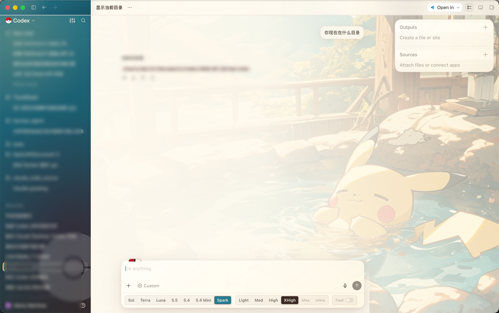
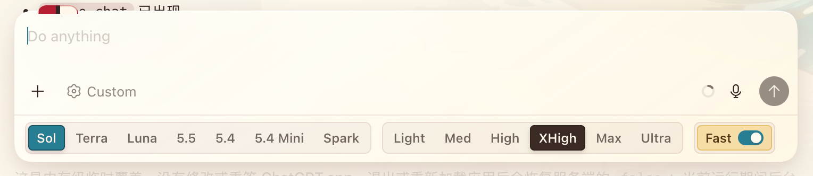
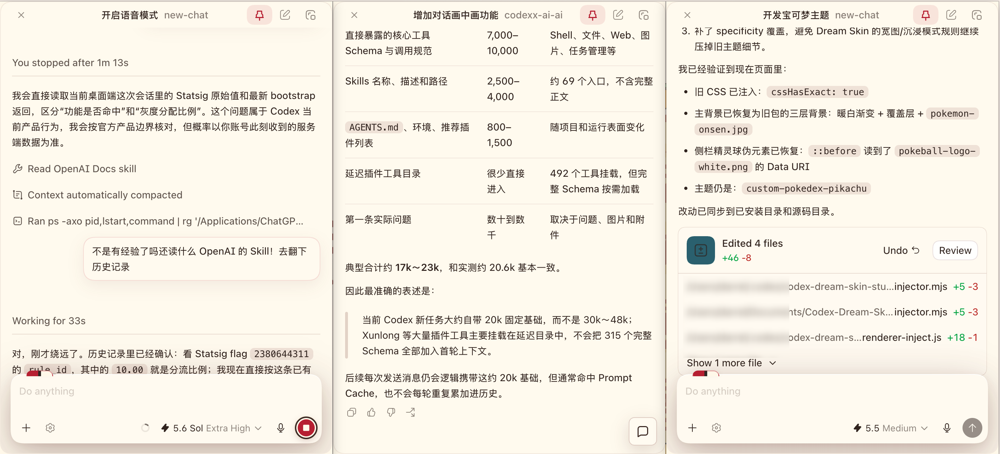

# Codex Plus Pro 1.7.3

`Codex Plus Pro.app` 是一套用于 macOS Codex / ChatGPT 桌面版的非官方本地增强：宝可梦训练家主题、桌面宠物通知管理、模型参数平铺，以及任意历史任务的置顶画中画监控。

它不会修改官方 App 文件、账号数据或任务记录。启动器只在本机启动官方 App，并通过 `127.0.0.1` 上的调试端口注入界面增强。

## 主要功能

- 图鉴红训练家侧栏、Poké Ball 标识、温泉皮卡丘壁纸与半透明工作区
- 模型、思考强度和 Fast 模式直接平铺在输入框底部
- 任意已保存历史任务的 Popout 入口、进度监控模式与跨应用置顶
- 桌面宠物通知的关闭状态持久化
- 设置窗口可独立开关主题、宠物、画中画和便捷模型选择
- `打开原版 Codex.app` 一键停止注入并恢复官方启动方式

## 界面预览

### 宝可梦训练家主题



### 模型参数快捷栏



### 多任务画中画



## 桌面宠物通知

点击通知卡片左上角的 `×`，只会从宠物浮层中关闭这条通知，不会把对应任务标记为已读。

关闭后，项目会按“通知 ID + 本轮 turnKey”保存在 Codex 本地存储中。下次启动宠物时，同一轮结果不会再次悬浮；任务产生新一轮结果后，因为 turnKey 已变化，新通知仍会正常出现。

## 从源码打包

要求：

- macOS 12 或更高版本
- 已安装官方 ChatGPT / Codex App，并位于 `/Applications` 或 `~/Applications`
- 系统自带的 `zsh`、`sips`、`iconutil`、`codesign` 和 `ditto`

仓库只提交 README 展示所需的脱敏截图，不提交本机预构建的 `.app`、签名目录、日志或未脱敏调试截图，以免把开发者证书、绝对路径、任务名和账号显示名带入公开历史。请在自己的 Mac 上构建：

```zsh
git clone https://github.com/pikapikaspeedup/Codex_Plus_Pro.git
cd Codex_Plus_Pro
./scripts/build.zsh
```

构建脚本不需要 npm，也不会下载依赖。完成后会在 `dist/` 生成：

```text
dist/
├── Codex Plus Pro.app
├── 打开原版 Codex.app
└── Codex-Plus-Pro-1.7.3-macOS.zip
```

如需指定输出目录：

```zsh
./scripts/build.zsh /path/to/output
```

脚本会从 `source/` 组装两个 App、生成 `AppIcon.icns`、执行 ad-hoc 签名并验证签名。ad-hoc 签名不等于 Apple Developer ID 公证。

## 安装与使用

1. 完成上面的本地构建。
2. 把 `dist/Codex Plus Pro.app` 和 `dist/打开原版 Codex.app` 拖入「应用程序」文件夹；也可以留在 `dist/` 中运行。
3. 首次启动如遇 macOS 无法验证开发者，请右键 `Codex Plus Pro.app`，选择「打开」，再确认一次。
4. 双击 `Codex Plus Pro.app`。启动器会正常退出正在运行的官方 Codex，再带着本地增强重新打开。
5. 点击侧栏搜索按钮左侧的设置图标，可分别启用或关闭主题、桌面宠物、画中画增强和便捷模型选择。

原有账号、任务和模型配置仍由官方 Codex 保存。

## 输入参数平铺

- `模型`：直接选择 Sol、Terra、Luna、5.5 或 Spark。
- `思考`：直接选择 Light、Medium、High、Extra High、Max 或 Ultra；不支持的档位自动禁用。
- `速度`：直接在 Standard 与 Fast 间切换。

参数栏调用 Codex 当前会话组件的官方状态 action。任务运行期间整栏禁用，避免中途切换配置。

## 画中画监控

1. 鼠标停在任意已保存的历史任务上。
2. 点击任务右侧新增的画中画图标。
3. 小窗会直接打开该任务，并默认置顶于其他应用。
4. 鼠标进入小窗时输入框浮出；移出或切换到其他应用后自动收起。
5. 任务运行时，收起态仍保留停止按钮。

刚创建但尚未保存的草稿任务没有持久 ID，因此不会显示画中画入口。

## 恢复原版

双击 `打开原版 Codex.app`。它会停止本项目的注入器、正常退出 Codex，然后不带调试参数重新打开官方 App。

也可以先退出 Codex，再从官方 ChatGPT / Codex 图标启动。项目从不写入 `/Applications/ChatGPT.app`。

## 兼容与排错

- 当前针对 Codex / ChatGPT macOS `26.721.30844` 验证。
- 日志：`~/Library/Logs/Codex-Plus-Pro.log`
- 运行状态：`~/Library/Application Support/Codex-Plus-Pro/`
- 如果增强没有出现，请退出所有 ChatGPT / Codex 窗口，再双击 `Codex Plus Pro.app`。
- 官方更新若改变 DOM 或内部服务，主题、通知工具或画中画可能需要同步适配；此时使用 `打开原版 Codex.app` 不受影响。
- 深度实现与维护方法见 [Codex-自定义主题开发指南.md](./Codex-自定义主题开发指南.md)。

## 隐私与安全

- 运行时仅连接 `127.0.0.1`，不连接项目自建服务器。
- 注入器不上传聊天内容，不读取账号凭据，不把页面正文写入日志。
- 宠物关闭状态只保存在 Codex 本地存储中，内容为通知 ID、轮次指纹和关闭时间。
- CDP 能操作当前 Codex 页面；运行期间，本机其他进程理论上也可能访问调试端口，因此只应在可信 Mac 上使用。
- 公开仓库通过 `.gitignore` 排除预构建 App、签名、工作目录、日志和可能含真实任务信息的本机临时截图；README 使用的脱敏展示图单独保存在 `docs/screenshots/`。

## 开源与素材

源代码和文档采用 MIT License。Pokémon、Pokédex、Pikachu 及相关标识归各自权利人所有，MIT License 不授予这些第三方素材、角色或商标的权利。详细素材来源见 [CREDITS.md](./CREDITS.md)。

本项目与 OpenAI、Nintendo、Creatures 或 GAME FREAK 无隶属关系。
